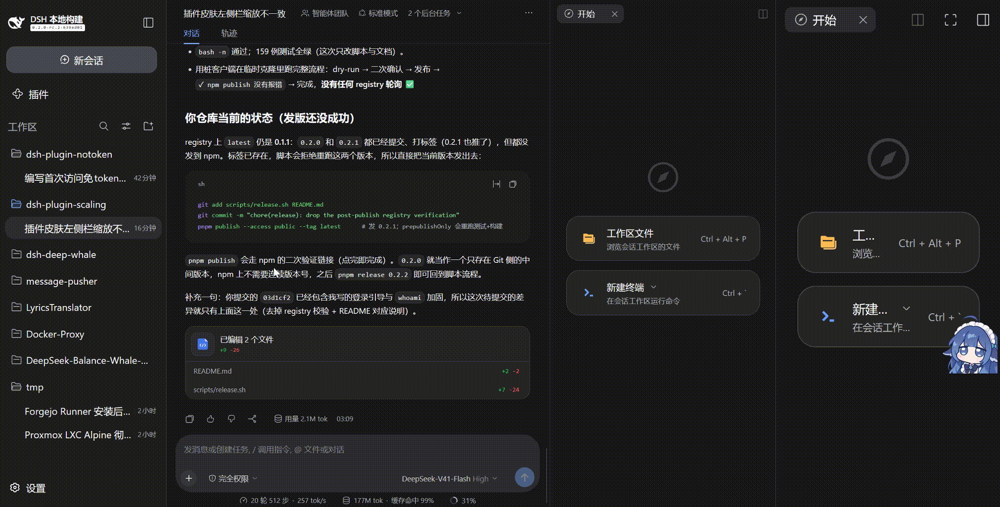
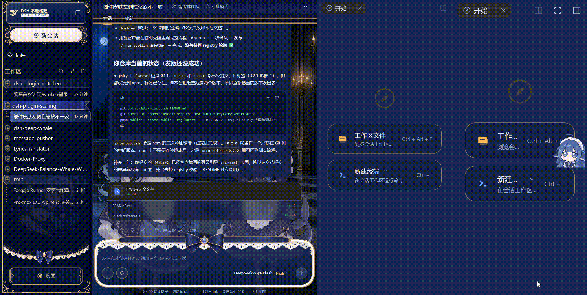

# dsh-plugin-scaling

给 DSH Web GUI 的三栏（左栏 / 中间主窗口 / 右栏）做**各自独立**的整体缩放：75%–150%、每档 5%。
纯前端插件：不改宿主、不依赖皮肤，数值存在插件自己的 `localStorage` 里。

## 用法

| 操作 | 作用 |
| --- | --- |
| `Ctrl` / `⌘` + 滚轮 | 缩放**指针所在栏** |
| `Ctrl` / `⌘` + `+` / `-` | 缩放**焦点所在栏** |
| `Ctrl` / `⌘` + `0` | 把该栏复位到 100% |

右栏拆成两列后，两列各算一栏、各自独立缩放。每次变化右下角会显示一下「栏名 + 百分比」。

悬停会话里「已修改文件」的行会弹出 diff 预览，它同样是独立的缩放对象：指针停在预览上时
`Ctrl+滚轮` **只缩放卡片里的 diff 内容**——卡片本身的边框、内边距与位置保持宿主的样式不动，
三栏取值也不受影响（在此之前事件会落到浏览器，触发整页缩放）。

预览是**临时**的：鼠标移开、卡片关闭后它的缩放值会清零，下次悬停打开的是 100% 的新卡片。
键盘路径按「焦点所在栏」解析，而预览卡片不可聚焦，所以复位预览请用 `Ctrl+滚轮` 往回滚。




## 安装

包内 `lib/` 已入库，安装后不需要再构建：

```sh
# 本地安装
dsh plugin --profile web add /root/dsh-plugin-scaling
# 从npm安装
dsh plugin --profile web add @beyondandsharp/dsh-plugin-scaling
# 或从 git 安装
dsh plugin --profile web add github:BeyondandSharp/dsh-plugin-scaling
```

装完刷新页面即可用。在「设置 → 插件」里可以停用：停用即完全恢复浏览器原生缩放，不留任何属性、样式、监听器或提示条。

## 存储

数值按浏览器保存，刷新/重启后恢复：

```
localStorage['dsh.plugin-scaling.v1'] = {"left":1,"center":1,"right":1,"right-1":1}
```

`right` 是第一列、`right-1` 是右栏第二列。存储不可用（隐私模式等）时退化为纯内存；损坏或越界的项按项忽略并夹紧到 75%–150%。

缩放机制由引擎探针决定：**Gecko（Firefox）用 `transform`，其它引擎用 `zoom`**——Gecko 的 `zoom`
不作用于 `border-image` 的九宫格几何，会让皮肤用对称素材画的装饰（「新会话」缎带、输入框外框）
右端帽被拉伸或整框断开。该臂按栏打标、只在缩放 ≠ 100% 时生效；含工具栏的栏（中栏）把 transform
打在**工具栏下方的内容**上，所以会话头始终不受影响。

需要钉死机制时可以写存储项（改完刷新）：

```js
localStorage['dsh.plugin-scaling.mechanism'] = 'zoom' // 或 'transform' / 'auto'
```

取舍与原因见 [docs/DESIGN.md](./docs/DESIGN.md)。

## 说明

- 官方默认外观与大多数皮肤（`maid-atelier`、`orca-link` …）下行为一致，只使用宿主设计 token；与「设置 → 通用 → 内容字号」是相乘关系。
- 中栏顶部那一行（会话标题、视图页签、打开右栏的按钮）**不跟着中栏缩放**，始终按 100% 渲染；缩放只作用于它下面的内容。指针停在这一行上时 `Ctrl+滚轮` 交给浏览器做**整页缩放**，栏内其它位置仍是该栏缩放。
- **Gecko（Firefox）下 `border-image` 类皮肤装饰的右端帽会被默认的 `zoom` 拉伸**；上面的 `transform` 开关可修好这一条（该臂仍在验证中，见 DESIGN 里的取舍说明）。
- **Web 壳的 `Ctrl+±`/`0` 键位固定**（宿主快捷键服务把 `Ctrl+=` 判为浏览器保留组合而拒绝注册）；Electron 桌面壳上会注册成三条可改键命令，出现在「设置 → 快捷键」。
- 更细的取舍与实现说明（自校准、皮肤栏级装饰、宽度补偿等）见 [docs/DESIGN.md](./docs/DESIGN.md)。

## 开发

```sh
pnpm install        # 见 pnpm-workspace.yaml：不自动安装可选的宿主 peer
pnpm test           # vitest + jsdom
pnpm run build      # tsdown → lib/index.js + lib/client.js
```

## 发版

```sh
pnpm release 0.2.0            # 也可以用 patch | minor | major | prerelease
```

`scripts/release.sh` 的流程：

1. **预检**：仓库根、分支、工作区是否干净（有未提交改动直接拒绝，`--allow-dirty` 可跳过）、
   当前版本、`npm`/`pnpm` 可用性、**npm 登录状态**、推送远端（`origin` → 分支上游 → 唯一远端）。
   未登录时会直接执行 `npm login`/`pnpm login` 并等待你完成登录，然后继续（非交互终端会直接报错中止，
   以免把提交/标签/推送做完才发现没登录）。
2. **版本校验**：必须**严格大于** `package.json` 里的版本，也要大于 npm 上已发布的最新版；
   本地标签或 registry 上已存在同版本会直接中止。任何一步失败都会把 `package.json` 回滚。
3. **测试与构建** → `pnpm test` + `pnpm run build`，并检查 `lib/index.js`、`lib/client.js`、
   `cordis.patch.yml` 都在。
4. **打包预览**：`npm pack --dry-run`，核对 `files` 白名单确实包含入口与文档。
5. **提交与打标签**：`chore(pkg): bump version to X.Y.Z` + 附注标签 `X.Y.Z`（与仓库现有标签风格一致）。
6. **同步上游**：推送当前分支与标签到 `origin`（`--no-push` 可跳过）。
7. **`npm publish --dry-run`**：不写 registry，只打印将要发布的内容。
8. **二次确认**：终端里确认后才真正 `npm publish`；npm 给出二次验证链接时，在浏览器完成授权，
   脚本会等它结束（没有网页验证时可用 `--otp <code>`）。
9. **以退出码为准结束**：`npm publish` 不报错即视为发布成功（不做发布后的 registry 轮询）；
   报错时给出单条重试与整条回滚的命令。

其它开关：`--dry-run`（全流程演练，什么都不写）、`--no-publish`（只提交/打标签/推送）、
`--tag <name>`（dist-tag，默认正式版 `latest`、预发布 `next`）、`--yes`（自动化场景跳过确认）。

## 许可

MIT，见 [LICENSE](./LICENSE)。`build/` 下的两个构建预设逐字 vendored 自
[dsh-deep-whale](https://github.com/Small-tailqwq/dsh-deep-whale)（上游是 [dsh-web-ui](https://github.com/zhu1090093659/dsh-web-ui) 的共享皮肤工程预设），同许可，署名见 [docs/DESIGN.md](./docs/DESIGN.md)。
